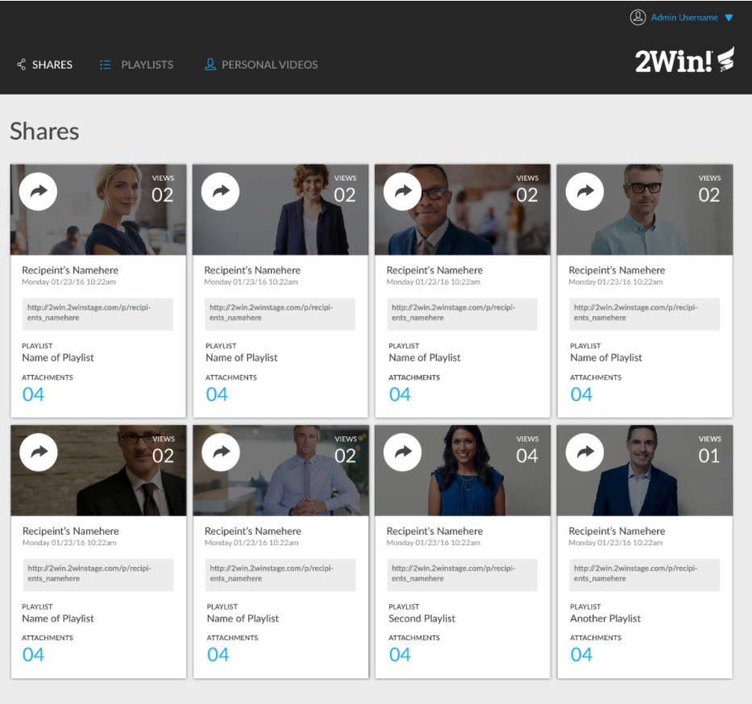
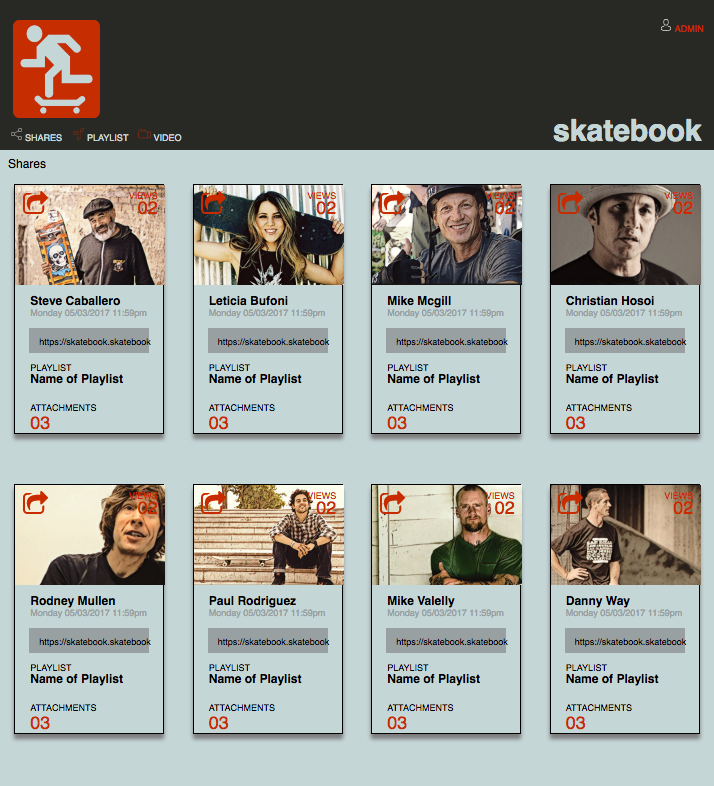

# Static Comp Challenge 2

This Static Comp was first designed with the mobile version in mind.  The layout was factored into two major boxes, a "header and a "photo-album".  the header included the site logo and the navigation links and selection buttons.  The photo-album is reserved to contain the photo cards.

the mobile version is designed to be 1 photo card wide, allowing the user to scroll down.  as the screen size grows media queries are met to accomodate 2, 3 and more cards.  At 900 pixels the header takes on the full size and disperses the previous links to the left side under the logo and the admin drop down is moved to the top right corner to match the comp design.

The color pallet of this comp was selected using Coolors based on the original orange of the logo.  Pictures were selected of prominent skateboarders then altered using the Prisma application to match the palette.

### Original Comp ###  

### Revised Comp ###

